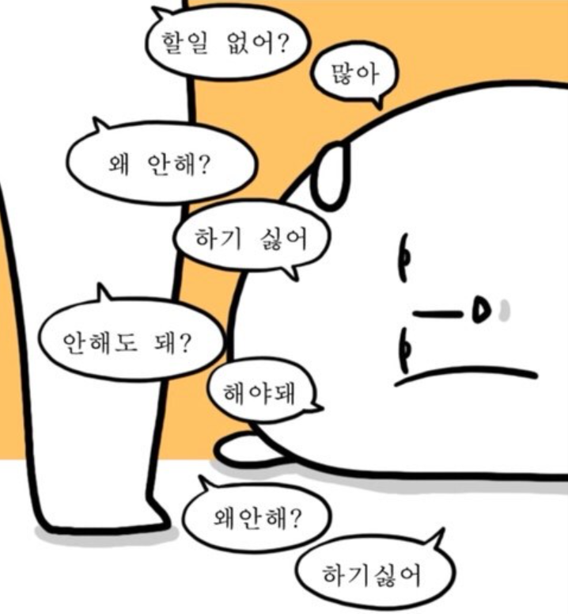

## 7월 8일 반성문

---

오늘은 아무것도 안 한 나에게 반성하고자 TIL 규칙에 세운 반성문을 작성하게 되었다.  
일단 오늘의 목표는 python 자료형 문법에 대한 복습을 완료하는 것과 컴활 1급 자격증 1과목 핵심 데이터 통신 공부하려는 목표를 가지고 있었다.  
하지만 나는 그 계획을 지키지 못했다.

일단 내가 계획한 일정은 오늘과 내일에 절반정도 나누어서 계획을 달성할 것이다.

## 🤔 일요일 계획은 어쩔것인가?

일단 일요일 계획도 다 지킬 것이다.  
아무리 8일 계획을 어겼다고 해도 미루게 되면 또 월요일 계획을 미루게 되고  
나중에 가서는 지켜지 않아서 일요일 계획은 지킬 생각이다.

## 🧐 내가 오늘 지키지 못한 약속을 다시 저지르지 않기 위해 어떻게 수습할 것인가?

1. 첫번째 계획의 일정은 아침에 확인하자
2. 두번째 지키지 못하는 계획은 가급적 세우지 않는다.
3. 세번째 계획을 여러 시간에 나눠서 이행하자
4. 네번째 계획을 잘 이행했는지 자기전에 돌아보자는 마음으로 점검하자

## 😎 앞으로 고생할 나에게

일단 고생하라 너의 과오다 그러게 계획을 잘 체크했어야지 그리고 일정은 잘 지켜줘  
아무리 귀찮고 힘들어도 나에게 다 좋은 양분이 되고 좋은 경험이 되기 때문에 포기하지 말고 열심히 노력하자
