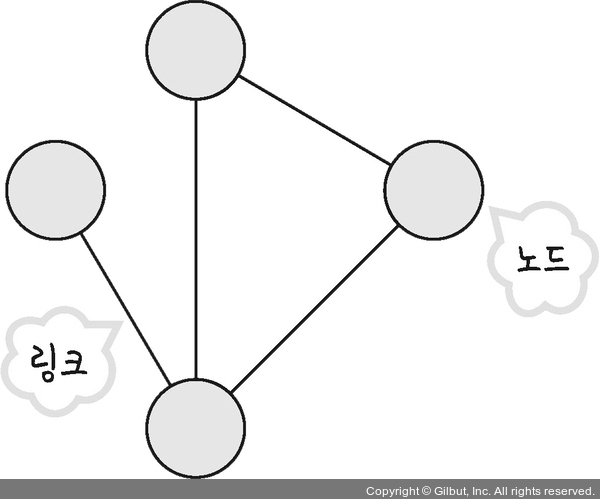
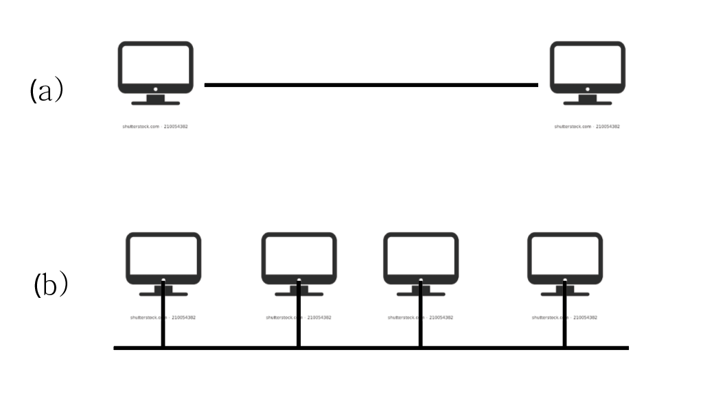

# 📁 네트워크(Network) 기초

네트워크란 노드(node)와 링크(link)서로 연결되어 있으며 리소스를 공유하는  
집합을 의미합니다.

여기서 노드란 서버, 라우터, 스위치 등 네트워크 장치를 의미하고 링크는 유선  
또는 무선을 의미합니다.

## 📝 링크, 노드, 클라우드

네트워크의 연결성은 다양한 단계에서 발생합니다.  
최저 단계의 네트워크는 동축 케이블이나 광섬유 등을 이용하여 두 대 이상의 컴퓨터가  
직접 연결되어 이루어 진다. 이러한 연결매체를 **링크(Link)**라고 한다.

또한 이를 이용해 연결된 컴퓨터들을 **노드(Node)** 라고 한다.

물리적 링크는 한 쌍의 노드로 제한되기도 하고 (이러한 링크를 **점대점(Point-to-Point)**라고 한다.)

그 밖의 경우에는 두 개 이상의 노드가 단일 링크를 공유할 수 있다. **(다중 접속(Mutiple-Access))**.

_(a) : 점대점, (b) : 다중 접속_

### ⇲ 클라우드(Cloud)란?

---

클라우드(Cloud)란, 광대한 네트워크를 통하여 접근할 수 있는 가상화된 서버와 서버에서 작동하는  
프로그램과 데이터베이스를 제공하는 IT 환경을 의미합니다. 클라우드를 이용하면 필요한 컴퓨팅 자원을  
인터넷으로 쉽게 이용할 수 있습니다.

### 🤔 클라우드와 클라우드 컴퓨팅 그리고 클라우드 서비스는 무엇이 다른가?

---

클라우드 컴퓨팅(Cloud Computing)이란, 클라우드를 이용하여 컴퓨팅 자원을 사용하는 기술적인 방법입니다.  
이는 서버, 스토리지, 네트워크 등의 자원을 가상화하여 사용자에게 제공하며, 필요에 따라 이를 확장하거나 축소할 수 있습니다.

클라우드 서비스(Cloud Service)란, 클라우드 컴퓨팅을 기반으로 제공되는 서비스를 의미합니다.  
이는 다양한 형태로 제공될 수 있으며, 대표적으로는 SaaS(Software as a Service, 소프트웨어 기반 서비스), PaaS(Platform as a Service, 플랫폼 기반 서비스),  
IaaS(Infrastructure as a Service, 인프라 기반 서비스) 등이 있습니다.

즉, 클라우드는 개념적인 측면에서의 인터넷을 통한 컴퓨팅 자원의 제공을 의미하며,  
클라우드 컴퓨팅은 이를 기술적인 측면에서 구하는 기술입니다. 마지막으로, 클라우드 서비스는  
클라우드 컴퓨팅을 기반으로 다양한 형태로 제공되는 서비스를 의미합니다.
