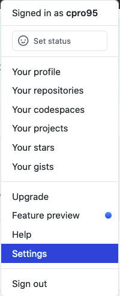
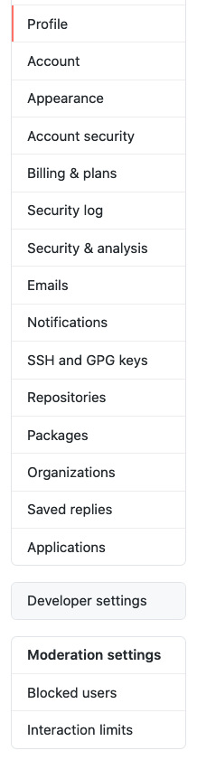
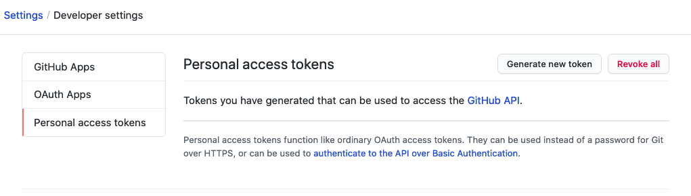
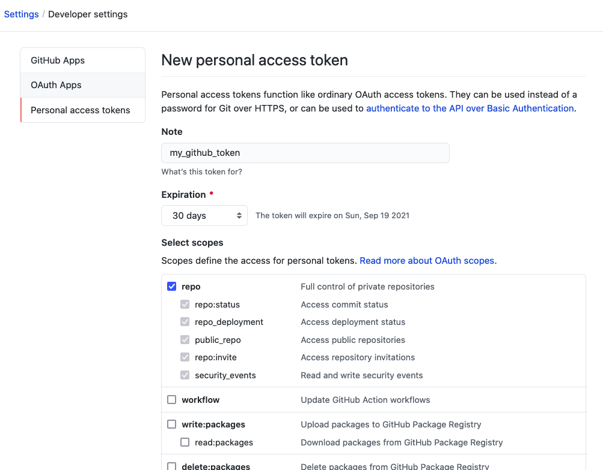
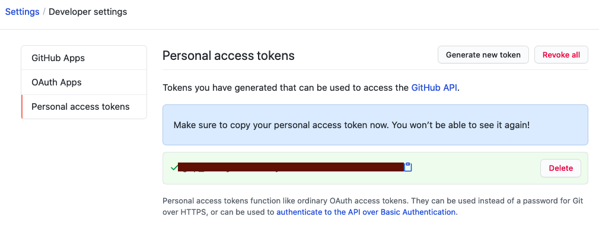

# GitHub 토큰 생성

  
오늘은 GitHub 토큰에 대해서 알아볼까 한다. 여태까지 난 GitHub에 Git 자도 몰랐던 거였다.  
이제라도 GitHub에 대해서 차근차근 알아보려고 한다. (열심히 하자!!)

### **Access Token 이란?**

---

- GitHub에서는 HTTPS 에서의 ID/Password 인증 방식을 금지하고 Access Token 인증 방식으로 전환되었습니다.
- Personal Access Token은 HTTPS 인증 시 Git의 암호 대신 사용하거나 API를 인증하는 데 사용할 수 있는 값 입니다.

### **Personal Access Token 생성**

---

1. github 로그인
2. 설정 페이지로 이동 (Settings)  
   
3. 하단에 Developer settings를 클릭  
   
4. Personal access tokens를 클릭하고 Generate new token을 클릭한다.  
   

5. 그럼 위와 같은 화면이 뜨는데 Note 란에 간단한 설명을 작성하시고 그리고 밑에 가장 중요한 repo 부분을 체크하시면 된다.

   

그리고 아래 그림처럼 맨 밑에 있는 Generate token을 눌러서 토큰을 만들면 된다.

그러면 아래처럼 자신의 토큰이 만들어졌습니다.  

### 🧐 토큰 생성 주의점

---

- 권한 지정 후 토큰 생성
- 생성한 토큰은 안전한 곳에 보관을 하자(클라우드 업로드 금지, 비밀번호 압축 권장)
- 토큰 생성 이후 권한은 변경 가능
- 유출에 주의 할 것
- 필요한 권한만 부여하여 보안을 강화해야 한다.

### 🤔 어디에 사용할 수 있는 건가?

---

1. 인증 및 접근 권한 : Github 토큰은 사용자 또는 애플리케이션의 인증을 위해 사용될 수 있습니다. 토큰은 사용자가 자신의 계정으로 인증하고 Github 리소스에 접근할 수 있도록 권한을 부여합니다.

   예를 들어, 토큰을 사용하여 API에 액세스하거나 Git 클라이언트를 사용하여 리모트 저장소에 푸시 및 풀 요청을 수행할 수 있습니다.

2. 애플리케이션 통합 : 토큰은 Github를 사용하는 애플리케이션과의 통합에 사용될 수 있습니다.

   애플리케이션이 GitHub API를 호출하거나 GitHub 서비스와 상호 작용해야 할 때, 토큰을 사용하여 인증 및 권한 부여를 처리할 수 있습니다.

   이는 애플리케이션에서 사용자 대신 GihHub 작업을 수행하거나 자동화된 프로세스를 구축할 때 유용합니다.

3. 워크플로우 자동화 : GitHub 토큰은 GiHub Actions, GitHub 워크플로우, CI/CD 파이프라인 등의 자동화된 오크플로우에서 사용될 수 있습니다.

   토큰은 코드 빌드, 배포, 테스트 등과 같은 작업을 자동으로 수행하는 동안 GitHub 리소스에 대한 액세스 권한을 제공합니다.
